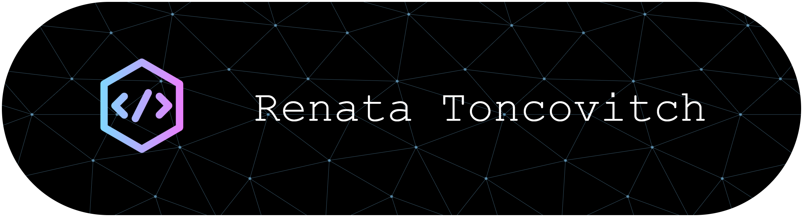

## "Hello, World!"

# Eu sou a Renata Toncovitch
🎯 Estudante de **Ciência da Computação**, com base sólida em Matemática e experiência prática em SQL, Excel avançado e modelagem matemática.  

💡 Motivada por transformar dados em decisões estratégicas usando lógica, estatística e tecnologias analíticas.

---
## 🛠️ Habilidades Técnicas
- **Linguagens e Bancos de Dados:** SQL, PL/SQL, R (análise estatística), noções de Python
- **Ferramentas:** Excel Avançado, Power Query, Power BI (iniciante)
- **Conhecimentos:** Modelagem Matemática, Lógica Fuzzy, Análise de Indicadores

---
## 📚 Formação
- **Ciência da Computação** – Unifil (em curso)
  
- **Licenciatura em Matemática** – UTFPR | 2016

Pesquisa e desenvolvimento em modelagem fuzzy, dinâmica populacional e crescimento tumoral.

---
## 💼 Experiência Profissional
**Analista Desenvolvedora de Sistemas II**  
*Set/2017 – Set/2021*  
- Desenvolvimento e manutenção de sistemas com uso extensivo de **SQL** para manipulação de grandes volumes de dados.  
- Apoio a processos de fechamento contábil, operações de previdência e portabilidade.  
- Análise e otimização de consultas e relatórios para melhoria de desempenho e integridade dos dados.
  
**Programadora Júnior**  
*Jun/2017 – Set/2017*  
- Análise estatística de dados e geração de dashboards com **R**.  
- Apoio à atualização e manutenção de publicações estatísticas institucionais.  
- Colaboração com equipe multidisciplinar para entrega de relatórios estratégicos.
  
**Auxiliar de Ensino de Matemática**  
*Mar/2016 – Jul/2016*  
- Acompanhamento individualizado de alunos no estudo de matemática.  
- Correção e revisão de materiais didáticos.  
- Apoio no planejamento de tarefas e organização de atividades acadêmicas.
  
---
## 📄 Publicações
### Artigos completos em periódicos
1. **Dinâmica do crescimento de tumores com controle através do modelo linear quadrático** – Revista Eletrônica Paulista de Matemática, v. 11ic, p. 72-90, 2017.  
   [Acessar revista](https://www.fc.unesp.br/Home/Departamentos/Matematica/revistacqd2228/v11a06ic-dinamica-do-crescimento-de-tumores.pdf)
2. **Diagnóstico de tumores: uma abordagem Fuzzy** – Revista Eletrônica Paulista de Matemática, v. 9ic, p. 49-68, 2017.  
   [Acessar revista](https://www.fc.unesp.br/Home/Departamentos/Matematica/revistacqd2228/v09a03ic-diagnostico-de-tumores-uma-abordagem-fuzzy.pdf)
---
### Trabalhos completos em anais de congressos
- Oficinas de Matemática em um programa de extensão: relato de uma experiência. (2015) – XVI Encontro Baiano de Educação Matemática, Salvador.  
- Avaliação diagnóstica como ponto de partida para elaboração de oficinas de matemática. (2015) – V Seminário de Extensão e Inovação da UTFPR, Campo Mourão.  
- Educação inclusiva para alunos com necessidades especiais: uma análise documental. (2015) – XIII Encontro Paranaense de Educação Matemática, Ponta Grossa.  
- Uma reflexão sobre aprendizagem de frações em um programa de extensão. (2015) – IV Simpósio Internacional de Pesquisa em Educação Matemática, Ilhéus.  
- Programa de extensão utilizando a análise da produção escrita como estratégia de diagnóstico. (2014) – IV Seminário de Extensão e Inovação, Cornélio Procópio.  
- Análise da produção escrita em uma questão do 9º ano. (2014) – III Semana Acadêmica da Matemática da UTFPR - CP, Cornélio Procópio.  
- Investigações e resolução de problemas: abordagens para a sala de aula. (2013) – VII CIBEM, Montevidéu.  
- Tendências metodológicas e sua importância na formação de professores da educação básica. (2013) – VII CIBEM, Montevidéu.
---
### Resumos expandidos em anais  
- Oficinas de Matemática na Educação Básica: ações do Proext. (2015) – IV Semana da Matemática, Cornélio Procópio.  
- O modelo de Malthus e Verhulst na dinâmica de populações. (2015) – III CMACSE, Vitória.  
- Fundamentos da Teoria Fuzzy. (2015) – IV Semana Acadêmica da Matemática da UTFPR-CP, Cornélio Procópio.
---
### Resumos em anais
- Aplicações na certificação da qualidade da água. (2022) – I Congresso de Imunologia Aplicada, Londrina.
---
### Apresentações de trabalho
- Programa de extensão utilizando a análise da produção escrita como estratégia de diagnóstico. (2014) – Apresentação de trabalho / Comunicação.  
- Análise da produção escrita em uma questão do 9º ano. (2014) – Apresentação de trabalho / Comunicação.
---
## 📑 Treinamentos Complementares
### 📊 Análise de Dados e Estatística
- **Da centralidade à dispersão: conceitos da estatística descritiva** – UNIFIL (2020, 5h)  
- **Bioestatística: conceitos iniciais da estatística aplicada às ciências biológicas** – UNIFIL (2020, 5h)  
- **Introdução ao LaTeX** – UTFPR (2015, 40h)  
### 🔐 Segurança da Informação e Privacidade
- **New Data Protection Training (incluindo GDPR)** – Atos Origin (2020, 2h)  
- **OWASP: Top 10 & Web Applications** – Atos Origin (2019, 2h)  
- **Security and Safety Awareness** – Atos Origin (2017, 2h)  
### 💼 Gestão, Experiência do Cliente e Comunicação
- **Customer Experience** – Atos Origin (2019, 2h)  
- **Overview do Processo de Gestão de Serviços** – Atos Origin (2019, 2h)  
- **Workshops e Talk Shows sobre desenvolvimento do inglês e carreira** – Atos Origin (2019, 6h no total)  
### 📚 Formação Acadêmica Complementar e Projetos
- **Anéis e Módulos** – Universidade de Brasília (2016)  
- **Modelagem Fuzzy para descrever o grau de agressividade de tumores (Iniciação Científica)** – UTFPR (2015-2016)  
- **Observatório de Políticas e Legislação Educacional (Extensão)** – UTFPR (2014-2015, 1140h)  
- **Formação Continuada de Professores de Matemática da Educação Básica (Extensão)** – UTFPR (2013)  
- **Literatura e Formação do Leitor (PIBIC-Jr)** – UENP (2010-2012)
---
<h3 align="left">Connect with me:</h3>

## 📫 Como me encontrar
- **E-mail:** renata.neves@edu.unifil.br
---
💬 *"Dados contam histórias — a análise certa revela o final."*

